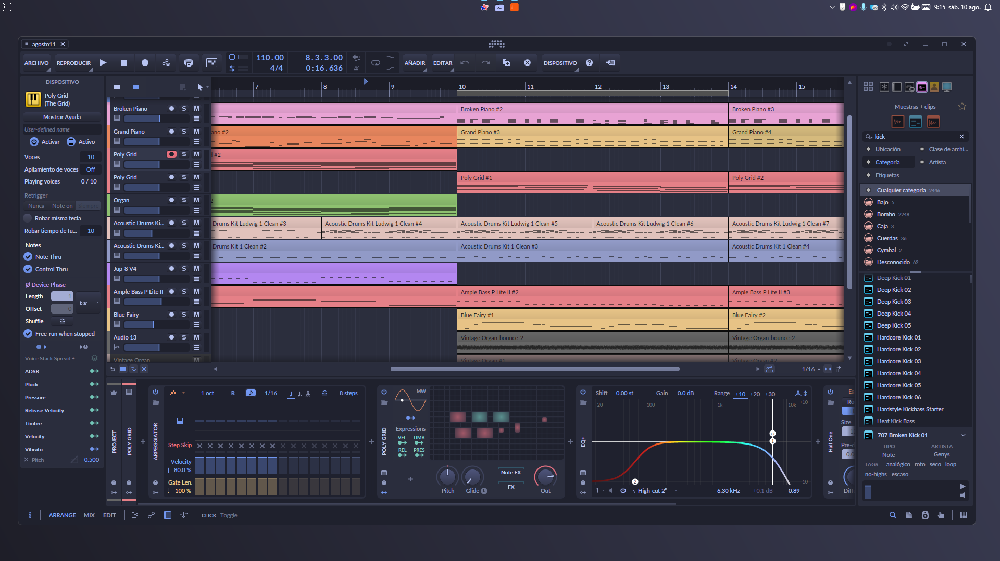

# Macchiato_BitwigTheme
Este tema esta inspirado en la paletta de colores [Catppucin Macchiato](https://catppuccin.com/palette)

# Instalacion 
- Siga los pasos recomendados por [Berikai](https://github.com/Berikai/awesome-bitwig-themes.git)
- Descargue el archivo [`macchiato.json`](macchiato.json)

# Capturas

